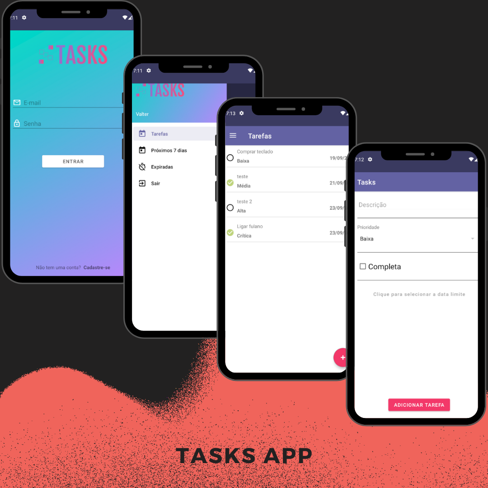

<h1 align="center">Tasks App </h1>

 🚀 Um app simples para cadastro, edição e remoção de tarefas.

<h1 align="center"></h1>

•
 <a href="#objetivo">Objetivo</a> •
 <a href="#tecnologias">Tecnologias</a> • 
 <a href="#autor">Autor</a> •

<h1 align="center">
    
    
    
</h1>

## **Objetivo**

 🔍 Estudando sobre Android e Kotlin 

## ⚙️**Tecnologias**

 🛠 Kotlin

 🛠 Android

 🛠 Retrofit

 🛠 SharedPreferences

 🛠 API

 🛠 ROOM

## **Autor**

 Desenvolvido por <a href="https://github.com/valtercfjunior">Valter Junior</a> seguindo o curso do Gabriel Ferrari Ceron na Udemy 

